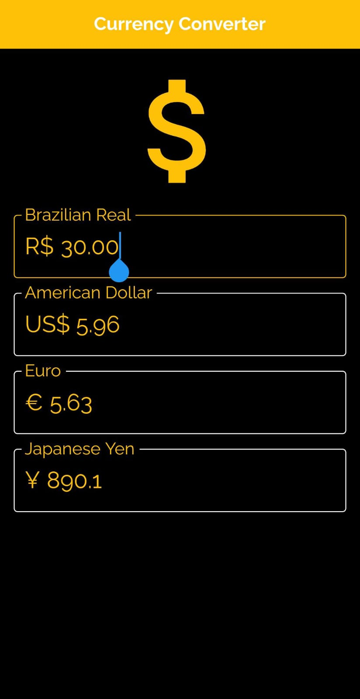

# 💲 Currency Converter Flutter App 🖩

Aplicação Mobile em Flutter - Conversor de moedas utilizando HG Finance API.

## ⚙️ Informações adicionais

- Flutter: v. 2.5.1
- Dart: v. 2.14.2
- HG Finance API
- Fonte: Raleway Regular e Raleway Bold
- HTTP: v. 0.13.4

## 🖼️ Imagens

  
  

  
  
